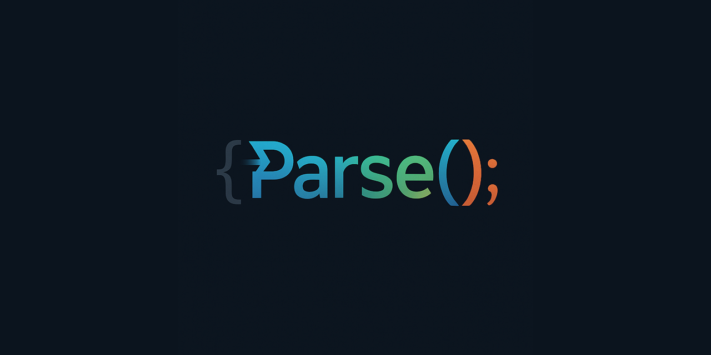

[](https://discord.gg/tPWjMwK) [](https://bsky.app/profile/tinybiggames.com)  

> 🚧 **Parse is Work in Progress**
>
> Parse is currently under active development and evolving quickly. Some features described in this documentation may be incomplete, experimental, or subject to significant changes as the project matures.
>
> We welcome your feedback, ideas, and issue reports — your input will directly influence the direction and quality of Parse as we strive to build the ultimate modern Pascal development platform.

## Parse
🚀 **Universal Language Engine** for building custom programming languages with ease! 

🔧 **Fluent API Design**: Define grammar rules using an intuitive, chainable API - no complex configuration files or external tools needed.

⚡ **LLVM-Powered**: Generate optimized native code through LLVM IR. Your custom languages compile to fast, efficient machine code.

🎯 **Runtime Processing**: Define and process languages at runtime - no separate generation step required! Parse and compile in a single, seamless workflow.

🌍 **Universal Support**: Create any language you can imagine - from simple domain-specific languages (DSLs) to full programming languages. The only limit is your creativity.

🔗 **Custom Callbacks**: Hook into the parsing process with OnMatch callbacks to generate custom IR, perform semantic analysis, or build abstract syntax trees.

📦 **Pascal/Delphi Native**: Built specifically for Pascal and Delphi developers, with clean interfaces and familiar patterns throughout.

## Quick Example
```pascal
// Create your language engine
var LParser: TPaParse;
LParser := TPaParse.Create;

// Set up the target module
LParser.SetModuleName('HelloWorld');

// Define grammar rules with fluent API
LParser
  .DefineRule('program_header')
  .Match('program')
  .MatchIdentifier()
  .Match(';')
  .OnMatch(procedure(const AContext: TPaParseContext)
    begin
      // Generate LLVM IR on match
      AContext.IR.TargetTriple(PaGetLLVMPlatformTargetTriple());
      AContext.IR.DataLayout(PaGetLLVMPlatformDataLayout());
    end);

// Define function declarations
LParser
  .DefineRule('function_declaration')
  .Match('function')
  .MatchIdentifier()
  .Rule('parameter_list')
  .Match(':')
  .MatchIdentifier()
  .OnMatch(procedure(const AContext: TPaParseContext)
    begin
      // Declare external functions in LLVM
      var LFuncType := AContext.IR.FunctionType(...);
      AContext.IR.DeclareFunction(AContext.Identifier, LFuncType);
    end);

// Parse your source code
const SOURCE = '''
  program HelloWorld;
  function printf(format: PChar, ...): Int32; 
    external "msvcrt.dll";
  begin
    printf("Hello, World!");
  end.
''';

LResult := LParser.ParseText(SOURCE, 'HelloWorld.pas');
if LResult.Success then
  WriteLn('Compiled to LLVM IR successfully!');
```

✨ **Key Features**:
- Fluent, chainable API for grammar definition
- Direct LLVM IR generation 
- No intermediate code generation steps
- Runtime language processing
- Extensible callback system
- Cross-platform support

Perfect for compiler researchers, language designers, and developers who need custom DSLs or want to experiment with language creation! 🎨

